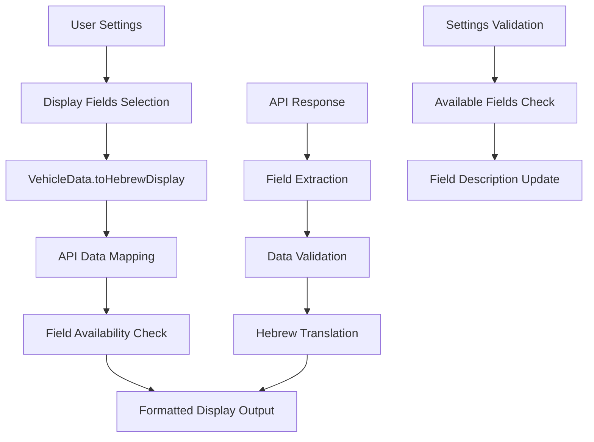

# Design Document - Display Fields Fix

## Overview

The issue with display fields not appearing in search results stems from a mismatch between the fields defined in UserSettings and the fields actually implemented in the VehicleData display logic. This design addresses the problem by auditing available API data, fixing the display implementation, and ensuring proper field mapping.

## Architecture

The fix involves three main components:
1. **API Data Audit** - Investigate actual API response structure
2. **VehicleData Model Enhancement** - Expand the toHebrewDisplay method
3. **Field Mapping Validation** - Ensure settings fields match available data



## Components and Interfaces

### 1. Enhanced VehicleData Model

The `VehicleData` class needs to be updated to handle all defined display fields:

```javascript
class VehicleData {
  constructor(data = {}) {
    // Existing basic fields
    this.licensePlate = data.mispar_rechev || '';
    this.manufacturer = data.tozeret_nm || '';
    this.model = data.kinuy_mishari || '';
    this.year = data.shnat_yitzur || '';
    this.color = data.tzeva_rechev || '';
    this.engineVolume = data.degem_manoa || '';
    this.fuelType = data.sug_delek_nm || '';
    this.ownershipType = data.baalut || '';
    this.testDate = data.tokef_dt || '';
    
    // Additional fields that may be missing
    this.vehicleType = data.sug_degem || data.sug_rechev || '';
    this.seats = data.mispar_moshavim || '';
    this.weight = data.mishkal_kolel || '';
    this.firstRegistration = data.moed_aliya_lakvish || '';
    this.lastInspection = data.mivchan_acharon_dt || '';
    this.modelCode = data.degem_nm || '';
    this.chassisNumber = data.misgeret || '';
    
    // Store raw data for debugging
    this.rawData = data;
  }
  
  toHebrewDisplay(userSettings) {
    const fields = [];
    
    // Map each setting field to display logic
    const fieldMappings = {
      manufacturer: () => this.manufacturer ? `🏭 יצרן: ${this.manufacturer}` : null,
      model: () => this.model ? `🚗 דגם: ${this.model}` : null,
      year: () => this.year ? `📅 שנת ייצור: ${this.year}` : null,
      color: () => this.color ? `🎨 צבע: ${this._translateColor(this.color)}` : null,
      engineVolume: () => this.engineVolume ? `⚙️ נפח מנוע: ${this.engineVolume} סמ"ק` : null,
      fuelType: () => this.fuelType ? `⛽ סוג דלק: ${this._translateFuelType(this.fuelType)}` : null,
      ownershipType: () => this.ownershipType ? `👤 סוג בעלות: ${this._translateOwnershipType(this.ownershipType)}` : null,
      testDate: () => this.testDate ? `🔍 תוקף טסט: ${this._formatDate(this.testDate)}` : null,
      vehicleType: () => this.vehicleType ? `🚙 סוג רכב: ${this._translateVehicleType(this.vehicleType)}` : null,
      seats: () => this.seats ? `💺 מספר מושבים: ${this.seats}` : null,
      weight: () => this.weight ? `⚖️ משקל: ${this.weight} ק"ג` : null,
      firstRegistration: () => this.firstRegistration ? `📋 רישום ראשון: ${this._formatDate(this.firstRegistration)}` : null
    };
    
    // Process each enabled field
    Object.entries(userSettings.displayFields).forEach(([fieldName, isEnabled]) => {
      if (isEnabled && fieldMappings[fieldName]) {
        const fieldDisplay = fieldMappings[fieldName]();
        if (fieldDisplay) {
          fields.push(fieldDisplay);
        }
      }
    });
    
    return fields.length > 0 ? fields.join('\n') : 'לא נמצאו נתונים';
  }
}
```

### 2. API Data Investigation

A utility function to log and analyze actual API responses:

```javascript
class ApiDataAnalyzer {
  static analyzeVehicleData(apiResponse) {
    const analysis = {
      availableFields: [],
      emptyFields: [],
      fieldSamples: {}
    };
    
    if (apiResponse && apiResponse.length > 0) {
      const sample = apiResponse[0];
      
      Object.keys(sample).forEach(key => {
        if (sample[key] && sample[key] !== '') {
          analysis.availableFields.push(key);
          analysis.fieldSamples[key] = sample[key];
        } else {
          analysis.emptyFields.push(key);
        }
      });
    }
    
    return analysis;
  }
  
  static logFieldMapping() {
    console.log('Current field mappings:');
    console.log('API Field -> Model Property -> Display Name');
    // Log mapping for debugging
  }
}
```

### 3. Settings Validation

Update UserSettings to reflect actually available fields:

```javascript
class UserSettings {
  static getFieldDescriptions() {
    return {
      // Core fields (always available)
      manufacturer: '🏭 יצרן',
      model: '🚗 דגם', 
      year: '📅 שנת ייצור',
      color: '🎨 צבע',
      
      // Common fields (usually available)
      engineVolume: '⚙️ נפח מנוע',
      fuelType: '⛽ סוג דלק',
      ownershipType: '👤 סוג בעלות',
      testDate: '🔍 תוקף טסט',
      
      // Optional fields (may not always have data)
      vehicleType: '🚙 סוג רכב',
      seats: '💺 מספר מושבים',
      weight: '⚖️ משקל',
      firstRegistration: '📋 רישום ראשון',
      
      // Special fields
      disabilityPermit: '♿ תו נכה'
    };
  }
  
  static getDefaultSettings() {
    return {
      language: 'he',
      displayFields: {
        // Enable core fields by default
        manufacturer: true,
        model: true,
        year: true,
        color: true,
        engineVolume: true,
        fuelType: true,
        ownershipType: true,
        testDate: true,
        disabilityPermit: true,
        
        // Disable optional fields by default (since they may be empty)
        vehicleType: false,
        seats: false,
        weight: false,
        firstRegistration: false
      },
      notifications: true,
      compactMode: false
    };
  }
}
```

## Data Models

### Field Mapping Strategy

1. **Primary Fields**: Always show if selected and available
2. **Secondary Fields**: Show if available, gracefully handle if missing
3. **Debug Mode**: Option to show raw API field names for troubleshooting

### Translation Enhancements

Add translation methods for new fields:

```javascript
_translateVehicleType(type) {
  const typeMap = {
    'פרטי': 'פרטי',
    'מסחרי': 'מסחרי',
    'אוטובוס': 'אוטובוס',
    'משאית': 'משאית',
    // Add more mappings based on actual API data
  };
  return typeMap[type] || type;
}
```

## Error Handling

### Graceful Field Handling

1. **Missing Data**: Skip fields with no data instead of showing empty values
2. **Invalid Data**: Validate and sanitize field values before display
3. **API Changes**: Handle cases where API field names change

### Debug Information

Add optional debug mode to show:
- Raw API response structure
- Field mapping status
- Which fields were requested vs. displayed

## Testing Strategy

### Unit Tests
- Test each field mapping individually
- Test with various API response structures
- Test graceful handling of missing fields

### Integration Tests
- Test with real API responses
- Verify settings changes reflect in display
- Test edge cases (all fields empty, partial data)

### Manual Testing
- Test with multiple vehicle types
- Verify Hebrew translations
- Check settings UI accuracy