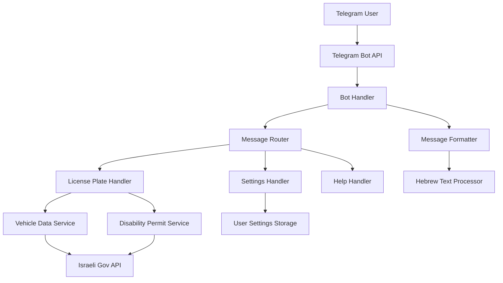

# עיצוב מערכת - בוט טלגרם לחיפוש רכבים

## סקירה כללית

הבוט יהיה מבוסס Node.js עם ספריית `node-telegram-bot-api` לטיפול בממשק הטלגרם. המערכת תכלול שלושה רכיבים עיקריים: מנהל הבוט, שירות API לנתוני הממשלה, ומנהל הגדרות משתמש. הבוט יתמוך בעברית כשפת ברירת מחדל עם ממשק אינטראקטיבי מבוסס כפתורים.

## ארכיטקטורה



### רכיבי המערכת

1. **Bot Handler** - מנהל את החיבור לטלגרם ומעבד הודעות נכנסות
2. **Message Router** - מנתב הודעות לטיפול המתאים
3. **Vehicle Data Service** - מבצע חיפושים ב-API הממשלתי
4. **User Settings Storage** - שומר העדפות משתמש
5. **Message Formatter** - מעצב הודעות בעברית עם כפתורים

## רכיבים וממשקים

### 1. Bot Handler (`src/bot/botHandler.js`)

```javascript
class BotHandler {
  constructor(token) {
    this.bot = new TelegramBot(token, { polling: true });
    this.messageRouter = new MessageRouter();
  }
  
  async start() {
    // הגדרת webhook או polling
    // רישום event handlers
  }
  
  async handleMessage(msg) {
    // ניתוב הודעות למטפל המתאים
  }
  
  async editMessage(chatId, messageId, text, options) {
    // עדכון הודעה קיימת במקום שליחת הודעה חדשה
  }
}
```

### 2. Vehicle Data Service (`src/services/vehicleDataService.js`)

```javascript
class VehicleDataService {
  constructor() {
    this.baseUrl = 'https://data.gov.il/api/3/action/datastore_search';
    this.vehicleResourceId = '0866573c-40cd-4ca8-91d2-9dd2d7a492e5';
    this.disabilityResourceId = 'c8b9f9c8-4612-4068-934f-d4acd2e3c06e';
  }
  
  async searchVehicle(licensePlate) {
    // חיפוש נתוני רכב
  }
  
  async checkDisabilityPermit(licensePlate) {
    // בדיקת תו נכה
  }
  
  async makeApiRequest(resourceId, query) {
    // בקשה כללית ל-API עם retry logic
  }
}
```

### 3. User Settings Manager (`src/services/userSettingsService.js`)

```javascript
class UserSettingsService {
  constructor() {
    this.storage = new Map(); // או מסד נתונים
  }
  
  async getUserSettings(userId) {
    // קבלת הגדרות משתמש
  }
  
  async updateUserSettings(userId, settings) {
    // עדכון הגדרות משתמש
  }
  
  getDefaultSettings() {
    // הגדרות ברירת מחדל
  }
}
```

## מודלי נתונים

### Vehicle Data Model

```javascript
class VehicleData {
  constructor(data) {
    this.licensePlate = data.mispar_rechev;
    this.manufacturer = data.tozeret;
    this.model = data.kinuy_mishari;
    this.year = data.shnat_yitzur;
    this.color = data.tzeva_rechev;
    this.engineVolume = data.nefach_manoa;
    this.fuelType = data.sug_delek;
    this.ownershipType = data.sug_baalut;
    this.testDate = data.tokef_dt;
    // שדות נוספים...
  }
  
  toHebrewDisplay(userSettings) {
    // המרה לתצוגה בעברית לפי הגדרות משתמש
  }
}
```

### User Settings Model

```javascript
class UserSettings {
  constructor(userId) {
    this.userId = userId;
    this.language = 'he'; // עברית כברירת מחדל
    this.displayFields = {
      manufacturer: true,
      model: true,
      year: true,
      color: true,
      engineVolume: true,
      fuelType: true,
      ownershipType: true,
      testDate: true,
      disabilityPermit: true
    };
  }
}
```

## טיפול בשגיאות

### Error Handler (`src/utils/errorHandler.js`)

```javascript
class ErrorHandler {
  static async handleApiError(error, chatId, messageId, bot) {
    const hebrewMessage = this.getHebrewErrorMessage(error);
    await bot.editMessageText(hebrewMessage, {
      chat_id: chatId,
      message_id: messageId,
      reply_markup: this.getRetryKeyboard()
    });
  }
  
  static getHebrewErrorMessage(error) {
    const errorMessages = {
      'NETWORK_ERROR': 'שגיאת רשת - אנא נסה שוב מאוחר יותר',
      'API_UNAVAILABLE': 'השירות אינו זמין כרגע',
      'INVALID_LICENSE_PLATE': 'מספר רישוי לא תקין',
      'NO_DATA_FOUND': 'לא נמצאו נתונים עבור מספר רישוי זה'
    };
    return errorMessages[error.type] || 'אירעה שגיאה לא צפויה';
  }
}
```

## אסטרטגיית בדיקות

### Unit Tests
- בדיקת פונקציות חיפוש רכב
- בדיקת עיצוב הודעות בעברית
- בדיקת טיפול בשגיאות
- בדיקת הגדרות משתמש

### Integration Tests
- בדיקת אינטגרציה עם Telegram API
- בדיקת אינטגרציה עם Israeli Government API
- בדיקת זרימת עבודה מלאה מחיפוש ועד תצוגה

### E2E Tests
- סימולציה של משתמש שולח מספר רישוי
- בדיקת עדכון הודעות דינמי
- בדיקת ממשק הגדרות

## הגדרות פריסה

### Environment Variables
```
TELEGRAM_BOT_TOKEN=your_bot_token
NODE_ENV=production
LOG_LEVEL=info
API_RETRY_ATTEMPTS=3
API_TIMEOUT=5000
```

### Docker Configuration
```dockerfile
FROM node:18-alpine
WORKDIR /app
COPY package*.json ./
RUN npm ci --only=production
COPY . .
EXPOSE 3000
CMD ["npm", "start"]
```

## ביצועים ואופטימיזציה

### Caching Strategy
- Cache של תוצאות חיפוש לזמן קצר (5 דקות)
- Cache של הגדרות משתמש בזיכרון
- Rate limiting למניעת spam

### Monitoring
- לוגים מפורטים של בקשות API
- מעקב אחר זמני תגובה
- התראות על שגיאות חוזרות

## אבטחה

### Input Validation
- בדיקת פורמט מספר רישוי ישראלי
- Sanitization של קלט משתמש
- Rate limiting לכל משתמש

### API Security
- HTTPS בלבד לכל הבקשות
- טיפול בטוח ב-tokens
- הגבלת גישה לנתונים רגישים